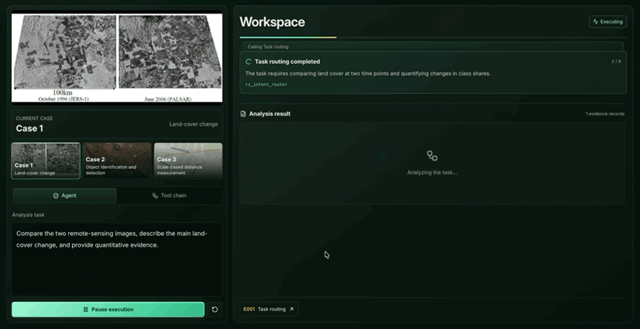

# RSure-Agent

[中文](#中文) | [English](#english)

## 🎬 演示视频 / Demo Video

**[▶ 观看完整演示（约 72 秒） / Watch the full demo (~72 seconds)](https://github.com/AIRS101/RSure-Agent/blob/main/demo-videos/rsure-agent-demo-combined.mp4)**

土地覆盖变化检测 → 目标识别与检测 → 比例尺测距。上方为动态预览，点击查看完整 MP4 视频。

Land-cover change analysis → object identification and detection → scale-based distance measurement. Click the animated preview to open the complete MP4 video.

## 中文

RSure-Agent 论文演示网站 - 展示基于证据链的可靠遥感智能体系统

### 🌐 在线演示

访问演示页面：[https://airs101.github.io/RSure-Agent/](https://airs101.github.io/RSure-Agent/)

本演示网站包含三个典型遥感分析案例，展示 RSure-Agent 如何通过可追溯的证据链完成复杂分析任务。

### 📄 论文信息

论文相关信息待补充

---

## English

RSure-Agent paper demonstration - Showcasing a reliable remote sensing agent system with evidence chains

### 🌐 Live Demo

Visit the demo: [https://airs101.github.io/RSure-Agent/](https://airs101.github.io/RSure-Agent/)

This demonstration includes three typical remote sensing analysis cases, showing how RSure-Agent completes complex analysis tasks through traceable evidence chains.

### 📄 Paper

Paper information to be added
