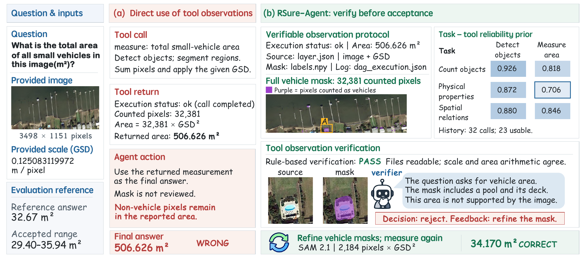
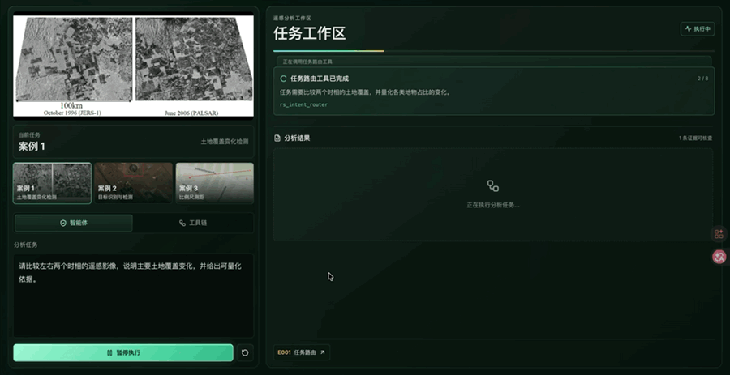

<h1 align="center">RSure-Agent</h1>

<p align="center">
  <strong>遥感智能体对工具观测的可靠利用</strong>
</p>

<p align="center">
  <a href="README.md">English</a> &nbsp;|&nbsp; <strong>中文</strong>
</p>

<p align="center">
  <a href="https://arxiv.org/abs/2610.04836"></a>
  &nbsp;
  <a href="https://github.com/AIRS101/RSure-Agent"></a>
  &nbsp;
  <a href="https://airs101.github.io/RSure-Agent/?lang=zh"></a>
  &nbsp;
  <a href="https://airs101.github.io/RSure-Agent/demo/?lang=zh"></a>
</p>

<p align="center">
  <a href="https://airs101.github.io/RSure-Agent/?lang=zh"></a>
  &nbsp;
  <a href="https://airs101.github.io/RSure-Agent/demo/?lang=zh"></a>
</p>

<p align="center">
  RSure-Agent 是一个遥感智能体，通过核验工具观测，减少错误在后续推理中的传播。
</p>

<p align="center">
  <a href="https://arxiv.org/pdf/2610.04836#page=1"></a>
</p>

<p align="center"><em>图 1：RSure-Agent 在使用工具观测进行后续推理前对其进行核验。</em></p>

## 发布计划

RSure-Agent 的相关材料将分阶段发布，发布进展将在本仓库更新。

- [x] 发布项目展示网站与中英文 README。
- [x] 发布变化检测、目标识别与比例尺测距的中英文演示视频及合集。
- [x] 补充论文信息、论文示意图与引用格式。
- [ ] 开源 RSure-Agent 核心代码，包括工具调用与观测核验模块。
- [ ] 提供环境配置、安装说明与示例案例运行指南。
- [ ] 发布实验评测脚本、运行配置与复现文档。

## 演示视频

<p align="center">
  <a href="https://github.com/AIRS101/RSure-Agent/blob/main/demo-videos/zh/rsure-agent-demo-combined-zh.mp4"></a>
</p>

<p align="center">
  <strong><a href="https://github.com/AIRS101/RSure-Agent/blob/main/demo-videos/zh/rsure-agent-demo-combined-zh.mp4">观看完整演示（约 57 秒）</a></strong>
</p>

<p align="center">
  上方为三个案例的动态预览，点击即可查看完整演示视频。
</p>

| 场景 | 演示内容 |
| --- | --- |
| [土地覆盖变化检测](demo-videos/zh/rsure-agent-demo-change-detection-zh.mp4) | 查看两个时相的分割叠加图与定量证据。 |
| [目标识别与检测](demo-videos/zh/rsure-agent-demo-object-detection-zh.mp4) | 查看储罐的视觉识别与目标检测证据。 |
| [比例尺测距](demo-videos/zh/rsure-agent-demo-scale-measurement-zh.mp4) | 查看 A、B 两点间距离的比例尺与量测证据。 |

## 论文

**[RSure-Agent：遥感智能体对工具观测的可靠利用](https://arxiv.org/abs/2610.04836)**

作者：Fuyuan Liu、Nayu Liu、Wenhao Yu、Peijin Wang、Yingchao Feng、Fanglong Yao、Liang Wan、Wei Feng。

[arXiv](https://arxiv.org/abs/2610.04836) · [PDF](https://arxiv.org/pdf/2610.04836) · [BibTeX](CITATION.bib)

### 摘要

遥感智能体依赖感知、量测和栅格分析工具完成对地观测任务。本文将这些工具返回的地物判断与量化结果称为工具观测。然而，工具正常执行并不保证观测正确。智能体一旦采纳错误观测，错误便可能在后续推理中传播，导致任务失败。我们分析三个遥感智能体基准上的 1,229 条执行轨迹，发现各基准中至少 88.1% 的任务依赖工具观测。在这些任务中，至少 22.7% 出现工具正常执行但观测错误的情况。在含错误观测的任务中，错误传播至最终答案的比例均不低于 82.0%。为此，我们提出 RSure-Agent，通过核验工具观测，抑制错误在后续推理中的传播。我们设计可核验观测协议，要求工具在返回观测的同时提供过程证据，供智能体核验。我们还基于离线任务反馈构建任务工具可靠性先验，统计不同工具配置在各类任务中的历史表现，为当前任务的观测核验提供经验参考。结合过程证据与可靠性先验，RSure-Agent 决定采纳当前观测、请求补充证据或拒绝该观测。我们在 EarthBench、ThinkGeo、TerraLogic 和 CHOICE-420 上评估该框架。与不启用核验和先验的基础配置相比，RSure-Agent 在三个智能体基准上的错误传播率降低 21.3 至 25.9 个百分点。在 CHOICE-420 上，相比直接作答，11 种主干模型的总体准确率平均提高 5.71 个百分点。在 EarthBench 上，工具调用比率相对 Earth-Agent 降低 25.9%。 项目地址为 [https://github.com/AIRS101/RSure-Agent](https://github.com/AIRS101/RSure-Agent)。

### 引用

如果使用或参考本工作，请引用以下论文。

```bibtex
@misc{liu2026rsureagentreliableusetool,
  title={RSure-Agent: Reliable Use of Tool Observations for Remote Sensing Agents},
  author={Fuyuan Liu and Nayu Liu and Wenhao Yu and Peijin Wang and Yingchao Feng and Fanglong Yao and Liang Wan and Wei Feng},
  year={2026},
  eprint={2610.04836},
  archivePrefix={arXiv},
  primaryClass={cs.CV},
  url={https://arxiv.org/abs/2610.04836},
}
```
